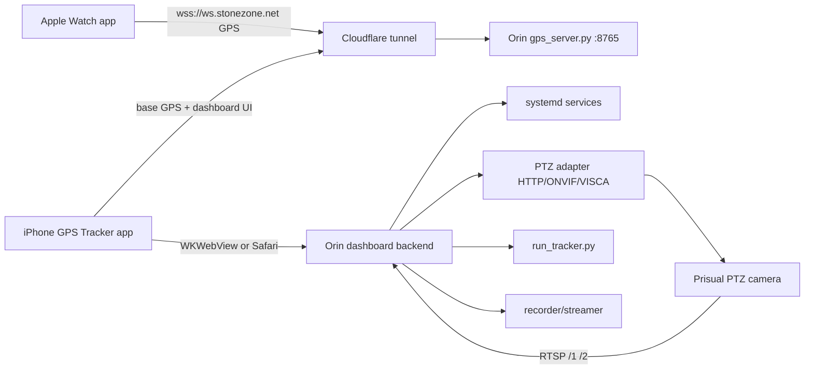

# JetsonTracker Dashboard and Control App Spec

Date: 2026-05-31

## Current Validated Facts

- Orin GPS service: `gps-server.service` runs `/data/projects/gimbal/gps_server.py` on `0.0.0.0:8765`.
- Public GPS path: `wss://ws.stonezone.net` reaches the Orin through Cloudflare.
- Watch GPS path: live Watch fixes reached the Orin after server-side CBOR support was added.
- iPhone/base path: the iOS app can connect, but current base fixes were observed as stale and need follow-up.
- Camera LAN: Orin Ethernet must be static on the camera subnet with no gateway. Internet stays on Wi-Fi/iPhone tether.
- Camera control: HTTP CGI velocity control works; ONVIF absolute move/readback works; VISCA UDP readback works.
- Camera video: RTSP `/1` is main/high-res; RTSP `/2` is sub/YOLO-friendly.
- Orin Nano constraint: no NVENC. Recording and livestreaming should use stream copy/remux or camera-side encode.

## Product Goal

One field operator should be able to power the system, open the iPhone app, confirm all health checks, calibrate the camera, start recording/tracking, manually adjust PTZ when needed, and monitor the session without using SSH.

The iPhone app should become the all-in-one operator surface:

- Native GPS relay remains in the existing iOS app.
- A new Dashboard tab embeds or links to the Orin-hosted dashboard.
- The Orin remains the authority for camera control, tracking, recording, livestreaming, config, and service health.
- The Watch remains the subject GPS source and can send direct-to-Orin through Cloudflare.

Feasibility: 8/10. Confidence: 0.85. Status: partially validated. The individual pieces are validated, but the dashboard integration is not built yet.

## Architecture

## Frontend Surfaces

### iPhone App

Add a tab-based operator UI to the existing GPS Tracker app:

- `Track`: current iPhone/base GPS and Watch relay controls.
- `Dashboard`: embedded Orin web dashboard through `WKWebView`.
- `Settings`: server URLs, Cloudflare dashboard URL, insecure local testing toggle, diagnostics export.

The iOS app should not duplicate Orin control logic. It should call the Orin dashboard API.

Feasibility: 8/10. Confidence: 0.8. Status: unvalidated.

### Orin Web Dashboard

Serve a responsive web app from the Orin. The first target should be iPhone Safari/WKWebView, then desktop.

Recommended stack:

- Backend: FastAPI or aiohttp on the Orin.
- Frontend: Vite/React or simple server-rendered HTML if speed matters more than UI complexity.
- Realtime: one WebSocket from dashboard to backend for status/events.
- Auth: Cloudflare Access for remote control; local LAN can be allowed separately.

Feasibility: 9/10. Confidence: 0.85. Status: unvalidated.

## Main Dashboard Layout

### Session Header

Shows:

- System state: `Idle`, `Calibrating`, `Tracking`, `Recording`, `Streaming`, `Fault`.
- Primary actions: `Start Session`, `Stop Session`, `Start Tracking`, `Stop Tracking`, `Record`, `Stream`.
- Current mode: `GPS_PRIMARY`, `GPS_ASSISTED`, `YOLO_PRIMARY`, `SEARCHING`, `MANUAL`.
- Big fault banner for blocking conditions.

Feasibility: 10/10. Confidence: 0.95. Status: unvalidated.

### Health Panel

Shows:

- Orin uptime, CPU, memory, disk free, temperature.
- `gps-server`, `cloudflared`, `tracker`, `recorder`, `streamer`, `dashboard` service states.
- Camera reachability: HTTP `80`, ONVIF `81`, RTSP `554`.
- Camera LAN: interface, IP, route, gateway absence.
- Internet route: active uplink, Cloudflare tunnel health.
- Last error per subsystem.

Feasibility: 9/10. Confidence: 0.9. Status: partially validated by current shell diagnostics.

### GPS Panel

Shows:

- Watch target fix: age, accuracy, speed, course, battery, seq, latency.
- iPhone base fix: age, accuracy, seq, lock status.
- Distance/bearing from base to target.
- Drop counters: stale, out-of-order, parse errors.
- A map view if internet is available; otherwise numeric status is enough.

Critical behavior:

- Base lock should average iPhone GPS at setup time and reject bad fixes.
- Watch is the subject vector source.
- Do not use the midpoint `fused` value for camera pointing.

Feasibility: 9/10. Confidence: 0.9. Status: Watch path validated; iPhone stale-fix issue still open.

### Camera Preview

Options:

- MJPEG or periodic JPEG preview from RTSP `/2`: lower latency, browser-compatible, CPU cost from decode/JPEG encode. Feasibility: 7/10. Confidence: 0.75. Status: unvalidated.
- HLS remux from RTSP `/2`: browser-compatible, lower CPU if copy/remux works, but higher latency. Feasibility: 6/10. Confidence: 0.75. Status: unvalidated.
- Native RTSP in browser: not reliable on iPhone browsers. Feasibility: 2/10. Confidence: 0.95. Status: validated by platform behavior.
- WebRTC low-latency preview: possible, but harder on Orin Nano without NVENC. Feasibility: 4/10. Confidence: 0.7. Status: unvalidated.

Recommended first implementation: MJPEG/JPEG preview from `/2`, with an option to disable preview to protect tracking CPU.

### PTZ Control Panel

Controls:

- Directional nudge: left/right/up/down by `0.2`, `0.5`, `1`, `2`, `5` degrees.
- Velocity buttons: hold-to-move pan/tilt, release sends stop.
- Zoom: wide/tele buttons, slider, preset zoom levels.
- Absolute controls: pan/tilt/zoom current readback and target values from ONVIF/VISCA.
- Presets: home, beach setup, waterline, launch zone, last target.
- Emergency stop.

Rules:

- Manual control sets mode `MANUAL` or temporarily pauses tracking corrections.
- All commands are clamped by PTZ limits.
- Every command logs operator, time, and result.

Feasibility: 9/10. Confidence: 0.9. Status: camera control surfaces validated.

### Tracking Panel

Settings:

- Tracking enable/disable.
- Mode policy: GPS acquisition, YOLO fine framing, search behavior.
- YOLO confidence threshold.
- Target size gate for vision assist.
- GPS prediction horizon and latency compensation.
- Pan/tilt deadband.
- Slew limits.
- Max zoom by distance and speed.
- Lost target timeout.

Live readouts:

- Predicted bearing/distance/elevation.
- Current pan/tilt/zoom.
- YOLO boxes/confidence/FPS.
- GPS-vs-vision correction vector.
- Last command sent to camera.

Feasibility: 8/10. Confidence: 0.8. Status: partially implemented in Python but not dashboard-wired.

### Media Panel

Controls:

- Start/stop local recording.
- Start/stop livestream.
- Segment list and disk usage.
- Stream health: RTMP state, reconnect count, bitrate if available.
- Copy/remux only by default; no Orin video re-encode.

Feasibility: 8/10. Confidence: 0.8. Status: unvalidated.

### Network Panel

Shows and controls:

- Camera LAN interface profile: IP, mask, no gateway, route to camera.
- Wi-Fi/iPhone uplink status.
- Cloudflare tunnel status.
- DNS status.
- Camera IP and RTSP URLs.
- Optional "repair camera route" action.

Hard rule:

- The camera Ethernet profile must not install a default gateway.

Feasibility: 9/10. Confidence: 0.95. Status: validated.

### Logs Panel

Show tail views for:

- `gps-server`
- `cloudflared`
- `tracker`
- `recorder`
- `streamer`
- `dashboard`

Include filters:

- Errors only.
- GPS drops.
- Camera control.
- YOLO detections.
- Operator actions.

Feasibility: 9/10. Confidence: 0.9. Status: unvalidated.

## Calibration Workflow

Calibration must be a guided state machine, not a loose settings page.

### Step 1: Preflight

Required checks:

- Orin online.
- Camera reachable on Ethernet.
- Cloudflare tunnel active.
- Watch fixes recent enough.
- iPhone/base fixes recent enough.
- Camera position readback available.
- Recording disk has enough free space.

Blocking faults should stop calibration.

Feasibility: 10/10. Confidence: 0.95. Status: partially validated.

### Step 2: Lock Base Position

Procedure:

- iPhone sits near the camera/tripod.
- Collect 20-60 base fixes.
- Reject fixes with horizontal accuracy worse than 5 m.
- Average accepted fixes.
- Persist `camera_pose.json` with lat/lon/alt, accuracy, timestamp, and source.
- Warn if the iPhone moves after lock.

Phone physical heading does not matter for this step.

Feasibility: 9/10. Confidence: 0.9. Status: unvalidated.

### Step 3: Heading Calibration

Primary method:

- Operator points the camera at a known landmark or temporary subject with known GPS.
- Dashboard reads current ONVIF/VISCA pan position.
- Dashboard computes true bearing from camera/base GPS to landmark/subject.
- Persist `reference_heading = true_bearing - camera_pan`.

This is better than using iPhone compass heading. The phone can be mounted facing camera-front if convenient, but it is not required if camera pan readback and landmark calibration are used.

Feasibility: 9/10. Confidence: 0.9. Status: readback validated; workflow unbuilt.

### Step 4: Tilt Offset Calibration

Procedure:

- Operator centers a visible subject at a known distance/elevation.
- Dashboard reads current tilt.
- Compute/persist `tilt_offset_deg`.
- Repeat at two distances if practical.

Feasibility: 7/10. Confidence: 0.75. Status: unvalidated.

### Step 5: YOLO-Assisted Walk-Around Calibration

Procedure:

- Subject wears Watch and walks a shallow arc in front of the camera.
- Dashboard shows GPS-predicted image position and YOLO detection.
- Collect paired samples: GPS bearing/elevation, camera pan/tilt/zoom, YOLO box center.
- Fit small corrections for heading offset, tilt offset, and pan/tilt scale bias.
- Reject samples with poor GPS accuracy, weak YOLO confidence, or multiple plausible subjects.

Use this as refinement, not as the only calibration method. It depends on the subject being visible enough for YOLO.

Feasibility: 7/10. Confidence: 0.7. Status: unvalidated.

### Step 6: Zoom/FOV Calibration

Procedure:

- At several zoom positions, record ONVIF/VISCA zoom readback and apparent known target size.
- Fit a zoom-to-FOV curve.
- Persist curve in config.
- Use conservative zoom until this is calibrated.

Feasibility: 6/10. Confidence: 0.7. Status: unvalidated.

### Step 7: Dry Run

Procedure:

- Simulate tracking commands without moving the camera, then with movement enabled.
- Show predicted pan/tilt/zoom vs actual readback.
- Require stable Watch and base fixes before enabling real tracking.

Feasibility: 8/10. Confidence: 0.8. Status: unvalidated.

## Backend API

REST endpoints:

- `GET /api/status`
- `GET /api/health`
- `GET /api/config`
- `PATCH /api/config`
- `POST /api/session/start`
- `POST /api/session/stop`
- `POST /api/tracking/start`
- `POST /api/tracking/stop`
- `POST /api/ptz/nudge`
- `POST /api/ptz/velocity`
- `POST /api/ptz/absolute`
- `POST /api/ptz/zoom`
- `POST /api/ptz/stop`
- `POST /api/calibration/base-lock/start`
- `POST /api/calibration/base-lock/commit`
- `POST /api/calibration/heading/commit`
- `POST /api/calibration/tilt/commit`
- `POST /api/media/record/start`
- `POST /api/media/record/stop`
- `POST /api/media/stream/start`
- `POST /api/media/stream/stop`
- `GET /api/logs/{service}`

WebSocket endpoint:

- `GET /ws/dashboard`

Dashboard events:

- `health`
- `gps`
- `camera_pose`
- `ptz`
- `tracking`
- `vision`
- `media`
- `network`
- `log`
- `fault`

Feasibility: 9/10. Confidence: 0.85. Status: unvalidated.

## Backend Service Rules

- Dashboard backend runs as `dashboard.service`.
- Dashboard controls other services through narrow allowlisted commands, not arbitrary shell.
- Tracking loop must keep running if dashboard disconnects.
- Recording must not stop if tracking crashes.
- Livestream must not block recording or tracking.
- Manual PTZ commands must be rate-limited and logged.
- Config writes must be atomic and recoverable.

Feasibility: 8/10. Confidence: 0.85. Status: unvalidated.

## Security

Required:

- Cloudflare Access or equivalent authentication for remote dashboard control.
- No camera credentials, stream keys, Cloudflare tokens, or sudo passwords in git.
- Dashboard API should bind locally or behind tunnel by default.
- State-changing endpoints require authentication.
- Local debug mode can be insecure only on trusted LAN.

Feasibility: 8/10. Confidence: 0.85. Status: unvalidated.

## Implementation Order

1. Build Orin dashboard backend with status/health/logs only.
   - Feasibility: 10/10. Confidence: 0.9. Status: unvalidated.
2. Add PTZ controls and readback.
   - Feasibility: 9/10. Confidence: 0.9. Status: control surfaces validated.
3. Add GPS status and base-lock calibration.
   - Feasibility: 9/10. Confidence: 0.85. Status: Watch path validated, iPhone stale issue open.
4. Add camera preview from RTSP `/2`.
   - Feasibility: 7/10. Confidence: 0.75. Status: unvalidated.
5. Add heading/tilt calibration workflow.
   - Feasibility: 8/10. Confidence: 0.8. Status: unvalidated.
6. Add tracking controls and live tuning.
   - Feasibility: 8/10. Confidence: 0.8. Status: unvalidated.
7. Add media record/stream controls.
   - Feasibility: 8/10. Confidence: 0.8. Status: unvalidated.
8. Add Dashboard tab to the iOS GPS Tracker app using `WKWebView`.
   - Feasibility: 8/10. Confidence: 0.8. Status: unvalidated.

## Critical Open Items

- Fix or explain stale iPhone/base fixes after the CBOR server fix.
- Confirm whether Watch Direct UI changes from reconnecting to connected after restart.
- Reboot-test persistent camera Ethernet profile.
- Decide Cloudflare dashboard hostname.
- Decide dashboard auth mode before exposing controls remotely.
- Validate preview method on iPhone Safari/WKWebView.
- Define service names and exact systemd units for tracker, recorder, streamer, and dashboard.
