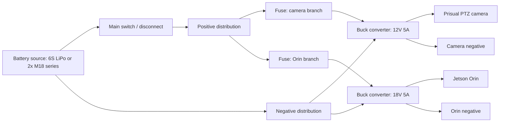

# WaveCam Field Power Wiring

This is the current field-power target for the Orin plus Prisual PTZ camera.
Wio/LoRa wiring is intentionally pending until the tracker hardware arrives and
its actual power/data interface is confirmed.

## Power Sources

| Option | Voltage reality | Feasibility | Status |
|---|---:|---:|---|
| 6S LiPo | 22.2V nominal, 25.2V full | 9/10 | Planned |
| Two Milwaukee M18 packs in series | 36V nominal, about 40V full | 8/10 | Planned; converters are user-confirmed 60V-rated |

The same downstream layout can support both sources only if both buck converters
are rated above the highest possible input voltage. Zack confirmed both buck
converters are rated for 60V input, which covers both a 6S LiPo and two M18
packs in series. Still verify the converter labels/spec sheets, polarity, and
output voltage before connecting the Orin or camera.

## Required Outputs

| Load | Output rail | Minimum converter output | Notes |
|---|---:|---:|---|
| Prisual PTZ camera | 12V DC | 5A | Fuse the positive input lead to the camera buck |
| Jetson Orin | 18V DC | 5A | Fuse the positive input lead to the Orin buck |

Do not connect the battery pack directly to the camera or Orin. Verify polarity
and output voltage with a multimeter before connecting either load.

## Block Diagram

## Wiring Checklist

1. Put the main switch or disconnect as close to the battery source as practical.
2. Split the positive feed into two fused branches after the main disconnect.
3. Put each fuse close to the split point, before the buck converter input.
4. Run one branch to the 12V/5A camera buck.
5. Run the other branch to the 18V/5A Orin buck.
6. Tie both buck converter negatives to the common battery negative bus.
7. Use waterproof connectors, strain relief, and cable glands for the case.
8. Label the 12V and 18V outputs so they cannot be swapped in the field.
9. Measure converter outputs under no load before plugging in hardware.
10. Re-measure voltage under load before sealing the enclosure.

## Fuse Sizing Notes

Fuse values need to be finalized after converter selection and inrush testing.
Starting points:

- Camera branch: 7.5A input fuse for 6S operation is a reasonable first test.
- Orin branch: 10A input fuse for 6S operation is a reasonable first test.
- With two M18 packs in series, input current is lower for the same output
  power, but converter inrush can still trip undersized fuses.

The fuse protects wiring and failure modes upstream of the converter. It does not
replace converter over-current protection.

## Deferred Wio/LoRa Notes

Do not commit final Wio wiring or Jetson config until the hardware is in hand.
The likely integration choices are:

| Option | Feasibility | Status |
|---|---:|---|
| Wio powered independently from its own battery | 8/10 | Unvalidated until hardware arrives |
| Wio powered from Orin USB | 7/10 | Unvalidated; depends on cable strain relief and USB stability |
| Wio powered from a small auxiliary buck | 7/10 | Unvalidated; more wiring but cleaner field service |

Final choice should be based on actual Wio current draw, waterproofing plan, and
whether the data path is USB serial, BLE, Wi-Fi, or Meshtastic serial.
